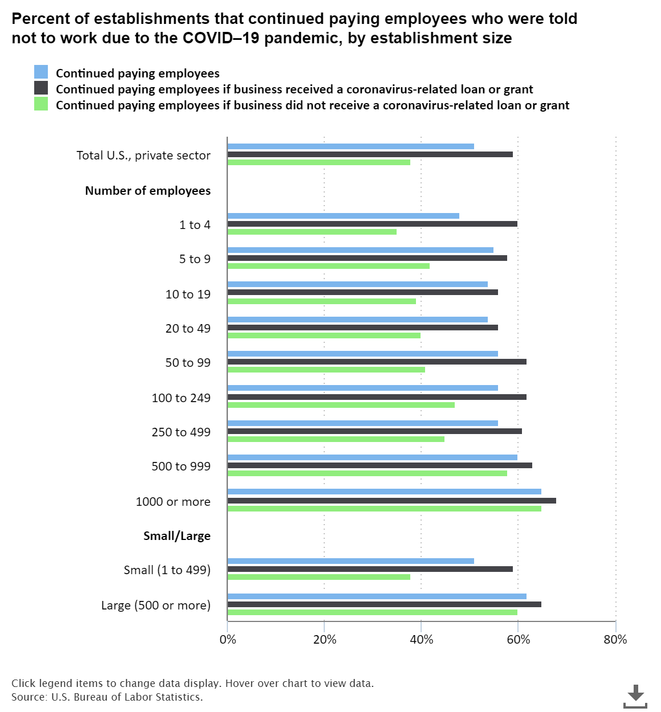

# How has COVID-19 impacted employment across industries since the beginning of the pandemic?
### We will analyze how establishments shifted operations during the first year of the pandemic

## Contents

* [Data Sources](#data-sources)
* [Methology](#methology)
* [Focus](#focus)
* [Findings](#findings)
* [Interesting Facts](#interesting-facts)

## Tableau Presentation
Explore more -
# [Capstone](https://public.tableau.com/views/QuezadaCapstone/Story1?:language=en-US&publish=yes&:display_count=n&:origin=viz_share_link)

### Data Sources
The U.S. Bureau of Labor Statistics developed new data on how U.S. businesses changed their operations and employment since the onset of the coronavirus pandemic. 

The BRS asked questions in three areas:

1) business experiences and payroll decisions, 

2) worker benefits and their ability to telework, and 

3) whether a business received a loan or grant from the government tied to the payroll.

Results from the Business Response Survey across the private sector, in combination with data collected by other current BLS surveys, 
will aid in understanding how employment has swifted across industries along with how businesses responded to government-mandated closures during the start pandemic.

### Methology

* Data was explored using Python and an API from the Bureau of Labor Statistics. 

* Presentation with the use of Tableau.

### Focus

I will address survey statistics collected and published during the pandemic to provide indications of changes in employment in the following sections: 

* Impact of the Pandemic on Employment

* Establishments shift to Telework(Remote work) 

* Demand for services and resources

### Findings

When employers who told employees not to work received a loan or grant tied to rehiring or maintaining employees on their payroll, 59 percent continued to pay employees who were told not to work. 
Only 38 percent of businesses that did not receive a loan or grant continued to pay employees told not to work.

When businesses did not receive a loan or grant, larger businesses (60 percent) were more likely to continue paying employees told not to work than were smaller businesses (38 percent).

### Interesting Facts

# Employed people who teleworked at some point in the past year because of the pandemic

The likelihood of teleworking because of the pandemic varied by occupation. 
In July, employed people were most likely to telework because of the pandemic in management, business, and financial operations occupations (46 %) and professional and related occupations (44 %). 

*In July 2021, about 1 in 4 employed people teleworked or worked from home for pay because of the coronavirus pandemic. 
The share of the employed who teleworked has declined over the last 3 months. The 26 percent of workers who teleworked in July was down from 31 percent in June and 35 percent in May.  
This measure does not include those whose telework was unrelated to the pandemic, such as employed people who worked entirely from home before the pandemic.